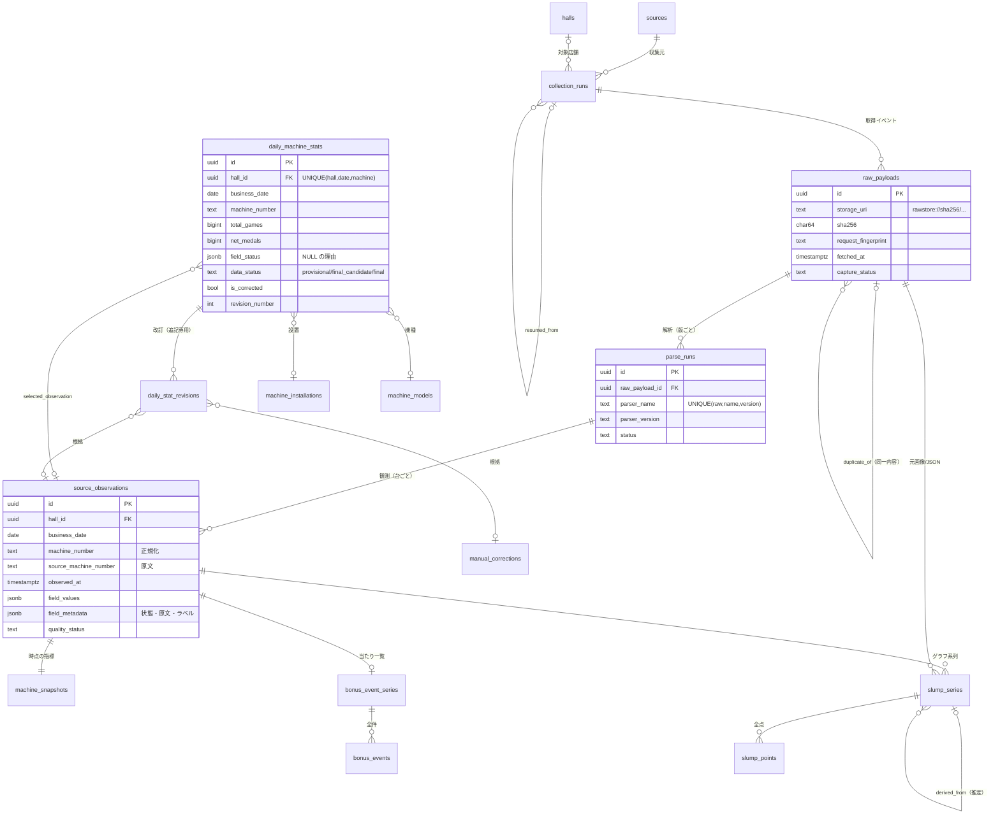
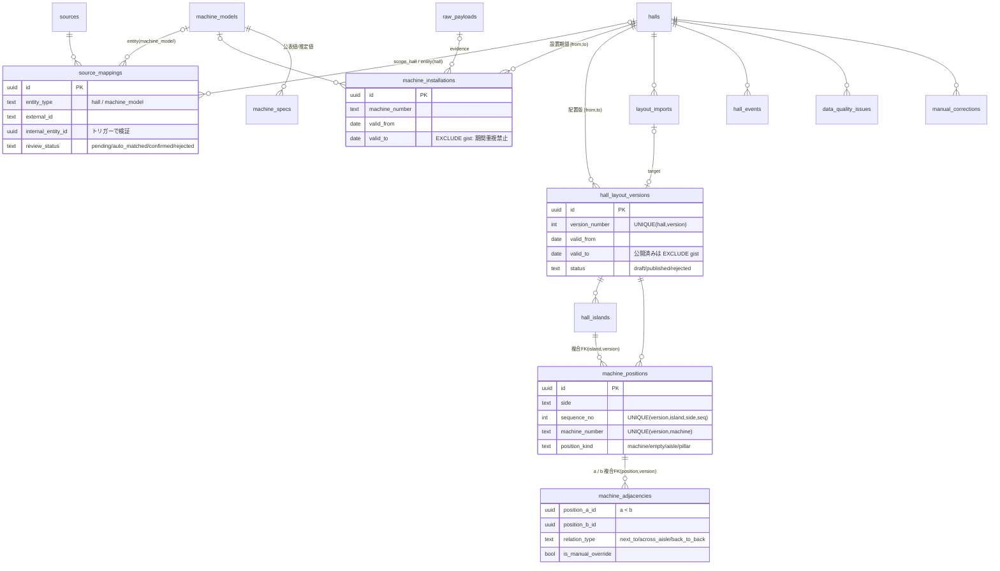

# ER 図

列の型・NULL・制約・索引の完全な定義は [schema_dictionary.md](schema_dictionary.md)（ORM から自動生成）を参照。
ここでは関係を示すため主要列だけを載せる。

## 収集・原本・観測・採用値

```mermaid
erDiagram
    sources ||--o{ collection_runs : "収集元"
    halls |o--o{ collection_runs : "対象店舗"
    collection_runs |o--o{ collection_runs : "resumed_from"
    collection_runs ||--o{ raw_payloads : "取得イベント"
    raw_payloads |o--o{ raw_payloads : "duplicate_of（同一内容）"
    raw_payloads ||--o{ parse_runs : "解析（版ごと）"
    parse_runs ||--o{ source_observations : "観測（台ごと）"
    source_observations ||--|| machine_snapshots : "時点の指標"
    source_observations ||--o| bonus_event_series : "当たり一覧"
    bonus_event_series ||--o{ bonus_events : "全件"
    source_observations ||--o{ slump_series : "グラフ系列"
    slump_series ||--o{ slump_points : "全点"
    slump_series |o--o{ slump_series : "derived_from（推定）"
    raw_payloads ||--o{ slump_series : "元画像/JSON"
    daily_machine_stats }o--o| source_observations : "selected_observation"
    daily_machine_stats ||--o{ daily_stat_revisions : "改訂（追記専用）"
    daily_stat_revisions }o--o| source_observations : "根拠"
    daily_stat_revisions }o--o| manual_corrections : "根拠"
    daily_machine_stats }o--o| machine_installations : "設置"
    daily_machine_stats }o--o| machine_models : "機種"

    raw_payloads {
        uuid id PK
        text storage_uri "rawstore://sha256/..."
        char64 sha256
        text request_fingerprint
        timestamptz fetched_at
        text capture_status
    }
    parse_runs {
        uuid id PK
        uuid raw_payload_id FK
        text parser_name "UNIQUE(raw,name,version)"
        text parser_version
        text status
    }
    source_observations {
        uuid id PK
        uuid hall_id FK
        date business_date
        text machine_number "正規化"
        text source_machine_number "原文"
        timestamptz observed_at
        jsonb field_values
        jsonb field_metadata "状態・原文・ラベル"
        text quality_status
    }
    daily_machine_stats {
        uuid id PK
        uuid hall_id FK "UNIQUE(hall,date,machine)"
        date business_date
        text machine_number
        bigint total_games
        bigint net_medals
        jsonb field_status "NULL の理由"
        text data_status "provisional/final_candidate/final"
        bool is_corrected
        int revision_number
    }
```

## マスター・物理配置・分析補助

```mermaid
erDiagram
    sources ||--o{ source_mappings : ""
    halls |o--o{ source_mappings : "scope_hall / entity(hall)"
    machine_models |o--o{ source_mappings : "entity(machine_model)"
    halls ||--o{ machine_installations : "設置期間 [from,to)"
    machine_models |o--o{ machine_installations : ""
    raw_payloads |o--o{ machine_installations : "evidence"
    halls ||--o{ hall_layout_versions : "配置版 [from,to)"
    hall_layout_versions ||--o{ hall_islands : ""
    hall_layout_versions ||--o{ machine_positions : ""
    hall_islands ||--o{ machine_positions : "複合FK(island,version)"
    machine_positions ||--o{ machine_adjacencies : "a / b 複合FK(position,version)"
    halls ||--o{ layout_imports : ""
    layout_imports |o--o| hall_layout_versions : "target"
    halls ||--o{ hall_events : ""
    machine_models ||--o{ machine_specs : "公表値/推定値"
    halls ||--o{ data_quality_issues : ""
    halls ||--o{ manual_corrections : ""

    source_mappings {
        uuid id PK
        text entity_type "hall / machine_model"
        text external_id
        uuid internal_entity_id "トリガーで検証"
        text review_status "pending/auto_matched/confirmed/rejected"
    }
    machine_installations {
        uuid id PK
        text machine_number
        date valid_from
        date valid_to "EXCLUDE gist: 期間重複禁止"
    }
    hall_layout_versions {
        uuid id PK
        int version_number "UNIQUE(hall,version)"
        date valid_from
        date valid_to "公開済みは EXCLUDE gist"
        text status "draft/published/rejected"
    }
    machine_positions {
        uuid id PK
        text side
        int sequence_no "UNIQUE(version,island,side,seq)"
        text machine_number "UNIQUE(version,machine)"
        text position_kind "machine/empty/aisle/pillar"
    }
    machine_adjacencies {
        uuid position_a_id "a < b"
        uuid position_b_id
        text relation_type "next_to/across_aisle/back_to_back"
        bool is_manual_override
    }
```
